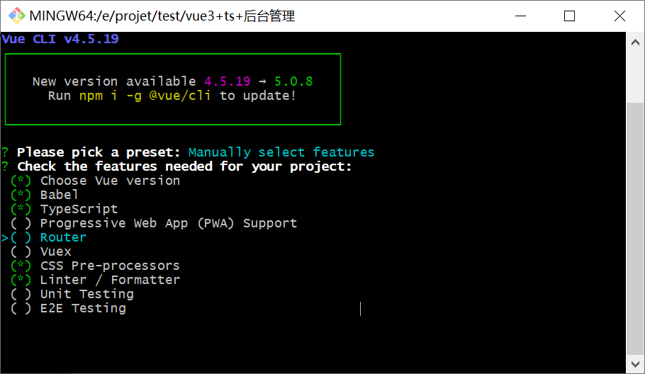
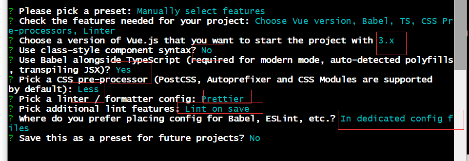
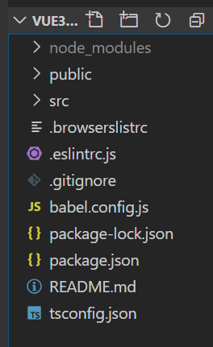
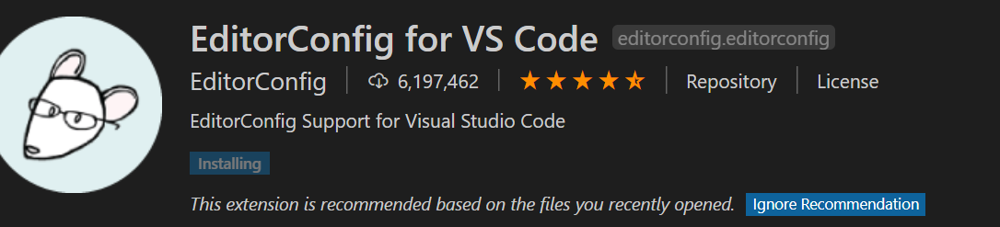
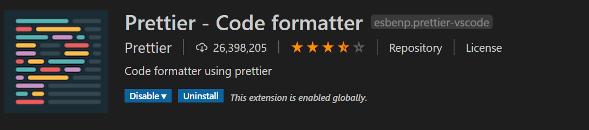
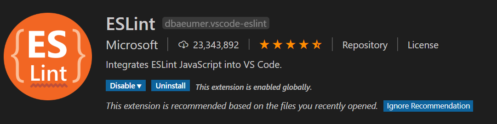
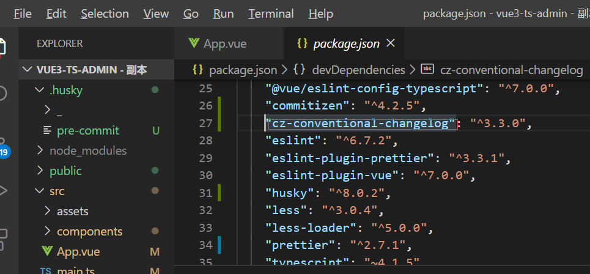
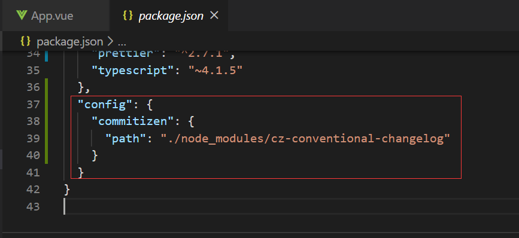
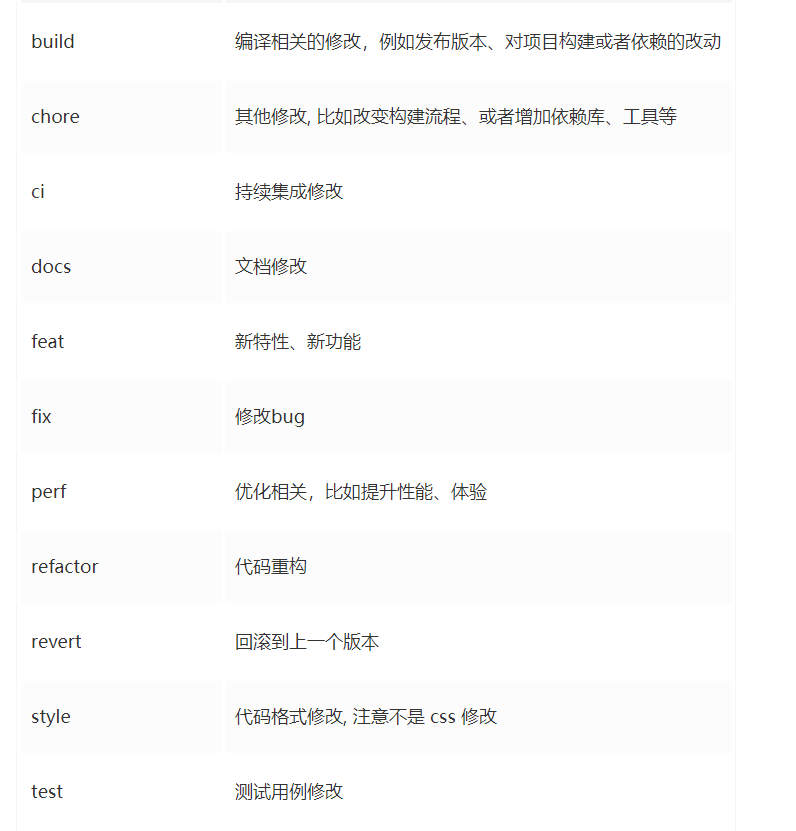
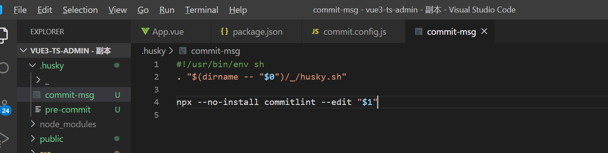

# vue3-ts-admin

## Project setup
```
npm install
```

### Compiles and hot-reloads for development
```
npm run serve
```

### Compiles and minifies for production
```
npm run build
```

### Lints and fixes files
```
npm run lint
```

### Customize configuration
See [Configuration Reference](https://cli.vuejs.org/config/).

##  项目搭建

### 使用脚手架初始化项目

```js
vue createe vue3-ts-admin
```



之后手动配置router、vuex



初始化目录结构



### 项目规范

#### 1、集成editorcinfig配置

editorConfig有助于为不同的IDE编辑器（vscode、webstorm等）上处理同一个项目的多个开发人员维护一致的编码风格。在 根目录下创建.editorconfig

```json
# http://editorconfig.org

root = true

[*] # 表示所有文件适用
charset = utf-8 # 设置文件字符集为utf-8
indext_style = space #缩进风格（他把| space）
index_size = 2 # 缩进大小
end_of_line = lf # 控制换行类型（lf | cr | trlf）
trim_trailing_whitespace = true # 去除行首的任意空白字符
insert_final_newline = true # 始终在文件末尾 添加新行

[*.md] # 表示仅 md 文件适用一下规则
max_line_length = off
trim_trailing_whitespace = false

```

#### 2、在vscode中安装插件 EditorConfig for VS Code



#### 3、使用prettier工具

prettirer 是一款强大的代码格式化工具，支持js、ts、css、scss、lesss、jsx、angular、vue等语言，基本上前端能用到的文件格式它都可以搞定，是当下最流行的代码格式化工具。

1. 安装prettier

​	```npm install prettier -D```

2. 配置.prettierrc文件

   - useTabs: 使用tab缩进还是空格缩进，选择false;
   - tabWidthL: tab是空格的情况下，是几个空格，选择2个；
   - printWidth: 当行字符的长度，推荐80，也有人喜欢100或者120；
   - singleQuote: 使用单引号还是双引号，选择true，使用单引号；
   - trailingComma: 在多行输入的尾逗号是否 添加，设置为none;
   - semi: 语句未尾是否要加分号，默认值是true,选择false表示不添加；

   ```js
   {
     "useTabs": false,
     "tabWidth": 2,
     "printWidth": 80,
     "singleQuote": true,
     "trailingComma": "none",
     "semi": false
   }
   ```

3. 配置.prettierignore，某些文件不需要prettier代码格式文件，则可以配置到这个文件中

   ```js
   /dist/*
   .local
   .output.js
   /node_modules/**
   
   **/*.svg
   **/*.sh
   
   /public/*
   
   ```

4. vscode 需要安装prettier的插件

5. 测试prettier是否生效

   - 测试一：在代码中保存代码

   - 测试二：配置一次性修改的命令 package.json,配置有个scripts,一次性格式化代码

     ```js
     "prettier": "prettier --write ."
     ```

#### 4、使用eslint检查

1. vscode安装eslint

2. 解决eslint和prettier冲突的问题：

   安装插件：（在vue创建项目时候，如果选择prettier,那么这两个插件会自动安装）

   ```js
   npm i eslint-plugin-prettier eslint-config-prettier -D
   ```

   添加prettier插件：在.eslintrc.js中添加

   ```js
   extends: [
       'plugin:vue/vue3-essential',
       'eslint:recommended',
       '@vue/typescript/recommended',
       '@vue/prettier',
       '@vue/prettier/@typescript-eslint',
       'plugin:prettier/recommended'
     ],
       
   module.exports = {
     root: true,
     env: {
       node: true
     },
     extends: [
       'plugin:vue/vue3-essential',
       'eslint:recommended',
       '@vue/typescript/recommended',
       '@vue/prettier',
       '@vue/prettier/@typescript-eslint',
       'plugin:prettier/recommended'
     ],
     parserOptions: {
       ecmaVersion: 2020
     },
     rules: {
       'no-console': process.env.NODE_ENV === 'production' ? 'warn' : 'off',
       'no-debugger': process.env.NODE_ENV === 'production' ? 'warn' : 'off'
     }
   }
   ```

####  5、git Husky 和eslint

虽然 我们已经要求项目使用eslint了，但是不能保证组员 提交代码之前都将eslint中的问题解决掉了。

- 也就是我们希望保证代码仓库中的代码也是要符合eslint规范的。
- 那梦我们需要在组员执行git commit 命令的时候对其进行校验, 如果不符合eslint规范，那么自动通过规范进行修复。

那么如何做到这一点呢？可以通过husky工具

- husky是一个git hook工具，可以 帮助我们触发git提交的各个阶段：pre-commit,commit-msg,pre-push

如何使用husky呢？

这里我们可以使用自动配置命令：

```js
npx husky-init
npm install husky -D
```

这里会做三件事：

1.安装husky相关的依赖：


2.项目目录下创建.husky 文件夹：


3.在package.json中添加一个脚本


​		接下来，我们需要去完成一个操作，在运行commit时候，执行lint脚本。


#### 6、git commit规范

​	通常我们的git commit 会按照统一的风格来提交，这样可以快速定位提交的内容，方便之后对版本进行控制。但是如果每次手动来编写这些是比较麻烦的事情，我们可以使用一个 工具：commitizen

- commitizen 是一个帮助我们去规范commit message的工具：

  1. 安装commitizen

     ```js
     npm install commitizen -D
     ```

  2. 安装cz-conventional-changelog，并且初始化cz-conventional-changelog

     ```js
     npx commitizen init cz-conventional-changelog --save-dev --save-exact
     ```

  3. 这个命令会帮助我们安装cz-conventional-changelog

     

  4. 并且在package.json中进行配置：

     

  5. 在package.json中配置commit命令，执行git  cz

     

     - 第一步是选择type,本次更新的类型

       

  - 第二部是选择本次修改的范围（作用域）

  - 第三步选择提交的信息

  - 第四步输入更详细的信息，可以 跳过

  - 第五步是否是一次大更新？

  - 第六步这次改变是否影响到某个open issue

  - 

    

- 如果我们按照cz来规范了提交风格，但是依然有同事通过git commit 按照不规范的格式提交后怎么办？

  - 我们可以通过commitlint来限制提交：

  - 安装 @commitlint/cli @commitlint/config-conventional

    ```js
    npm i @commitlint/cli @commitlint/config-conventional -D
    ```

  - 在根目录创建commitlint.config.js文件，配置commitlint

    ```js
    module.exports = {
      extends: ['@commitlint/config-conventional']
    }
    ```

  - 使用huskys生成commit-msg文件，验证提交信息：

    ```js
    npx husky add .husky/commit-msg 'npx --no-install commitlint --edit "$1"' 该命令 不行直接
    npx husky add .husky/commit-msg 然后在文件里面添加npx --no-install commitlint --edit "$1"
    ```

    

  - 这个时候提交的话就会报错了

    

### 8、vue-cl 不经过webpack打包的静态资源

#### assets文件下 (src/assets/) 通过相对路径被引入，这类引用会被webpack处理

比如：

会被编译成：

#### public 文件夹

放到public目录下的资源会被直接复制，不会经过webpack的打包处理。但是要注意的是：public中的空文件夹资源是不会被复制的。即使使用copy-webpack-plugin也是不会被copy的。

所以如果要引用的资源不希望被webpack处理时，可以将其放到public文件夹下，在index.html内引用资源文件且不希望被webpack处理时，可以加上前缀

```js
<%= BASE_URL %>
```


### 9、 vue.config.js配置

#### 1 导出对象

这个文件导出了一个包含了选项的对象：

```js
module.exports = {
  // 选项...
}
复制代码
```

接下来，详细介绍一些选项及配置：

#### 2基本配置

```js
module.exports = {
    productionSourceMap: false,
    publicPath: './',
    outputDir: 'dist',
    assetsDir: 'assets',
    devServer: {
        port: 8090,
        host: '0.0.0.0',
        https: false,
        open: true
    },
    // 其他配置
    ...
复制代码
```

- **productionSourceMap**：生产环境是否要生成 `sourceMap`

- **publicPath**：部署应用包时的基本 URL,用法和 `webpack` 本身的 `output.publicPath` 一致
  - 可以通过三元运算去配置`dev`和`prod`环境, `publicPath: process.env.NODE_ENV === 'production' ? '/prod/' : './'`
  - 
  - 运行**npm run build**，index.html中引入的各个文件就会有/pro
  - 

- **outputDir**: `build` 时输出的文件目录

- **assetsDir**: 放置静态文件夹目录
  - 设置放置打包生成的静态资源 (js、css、img、fonts) 的目录。注意： 该目录是相对于 `outputDir` 
  - 
  - 运行**npm run build**命令，在输出的文件中，静态文件都会放到assets目录下,这里把public下的readlma文件下的图片打包进来了，我们是不需要这些图片的，要移动到根目录下，/readlma
  - 

- **devServer**: dev环境下，`webpack-dev-server` 相关配置

  - **port**: 开发运行时的端口

  - **host**: 开发运行时域名，设置成`'0.0.0.0'`,在同一个局域网下，如果你的项目在运行，同时可以通过你的`http://ip:port/...访问你的项目`

  - **https**: 是否启用 `https`

  - **open**: `npm run serve` 时是否直接打开浏览器

#### 3 插件及规则的配置

在`vue.config.js`如果要`新增/修改` `webpack` 的 `plugins` 或者 `rules` , 有2种方式。

#####  `configureWebpack` 方式

configureWebpack 是相对比较简单的一种方式

- 它可以是一个`对象`：和 `webpack` 本身配置方式是一致，该对象将会被 `webpack-merge` 合并入最终的 `webpack` 配置

- 它也可以是一个`函数`：直接在函数内部进行修改配置,将覆盖webpack里面的配置

  ```js
  configureWebpack: {
      rules:[],
      plugins: []
    }
  configureWebpack: (config) => {
      // 例如，通过判断运行环境，设置mode
      config.mode = 'production'
  } 
  复制代码
  ```

##### `chainWebpack` 方式

chainWebpack 链式操作 (高级)，接下来所有的配置我都会在该选项中进行配置

#### 4 规则rules的配置

关于`rules` 的配置，我会分别从新增/修改进行介绍。

##### 1.rules的新增

在`webpack`中 `rules` 是 `module` 的配置项，而所有的配置的都是挂载到 `config` 下的，所以新增一个rule方式：

```js
config.module
  .rule(name)
    .use(name)
      .loader(loader)
      .options(options)
复制代码
```

##### 案例：`style-resources-loader` 来添加`less`全局变量

```js
npm install style-resources-loader -D
```

##### 案例：`svg-sprite-loader` 将svg图片以雪碧图的方式在项目中加载

```js
module.exports = {
    chainWebpack: (config) => {
        // 通过 style-resources-loader 来添加less全局变量
        const types = ['vue-modules', 'vue', 'normal-modules', 'normal'];
        types.forEach(type => {
            let rule = config.module.rule('less').oneOf(type)
            rule.use('style-resource')
                .loader('style-resources-loader')
                .options({
                    patterns: [path.resolve(__dirname, './lessVariates.less')]
                });
        });

        // `svg-sprite-loader`: 将svg图片以雪碧图的方式在项目中加载
        config.module
            .rule('svg')
            .test(/.svg$/) // 匹配svg文件
            .include.add(resolve('src/svg')) // 主要匹配src/svg
            .end() 
            .use('svg-sprite-loader')
            .loader('svg-sprite-loader') // 使用的loader，主要要npm该插件
            .options({symbolId: 'svg-[name]'}) // 参数配置
    }
}
复制代码
```

##### 2 rules的修改

针对已经存在的 `rule` , 如果需要修改它的参数, 可以使用 `tap` 方法：

```js
config.module
  .rule(name)
    .use(name)
      .tap(options => newOptions)

复制代码
```

##### 案例：修改`url-loader`的参数

```js
module.exports = {
    chainWebpack: (config) => {
        // `url-loader`是webpack默认已经配置的，现在我们来修改它的参数
        config.module.rule('images')
            .use('url-loader')
            .tap(options => ({
                name: './assets/images/[name].[ext]',
                quality: 85,
                limit: 0,
                esModule: false,
            }))
    }
}
复制代码
```

#### 插件plugins的配置

关于 `plugins` 的配置，我会分别从`新增/修改/删除`进行介绍。

##### 1.plugins的新增

- 注意：这里WebpackPlugin不需要通过`new WebpackPlugin()`使用。

  ```js
  config
    .plugin(name)
    .use(WebpackPlugin, args)
  复制代码
  ```

  