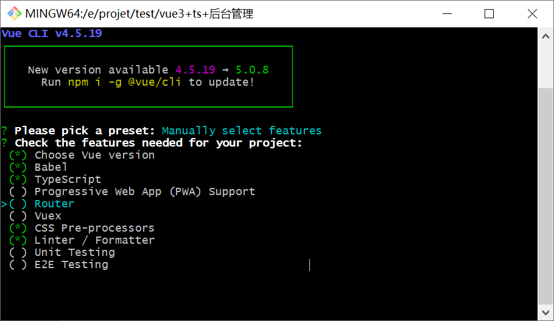
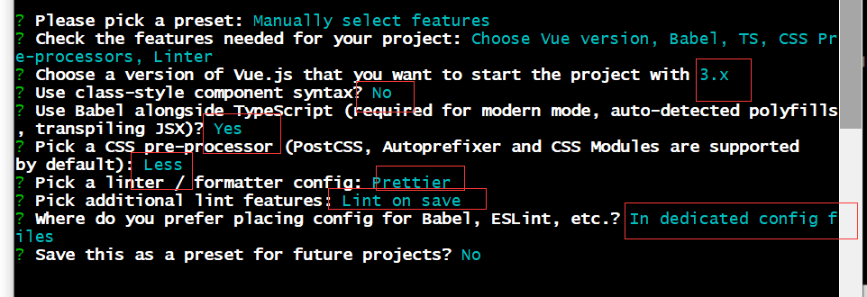
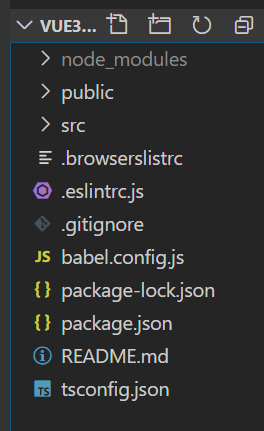
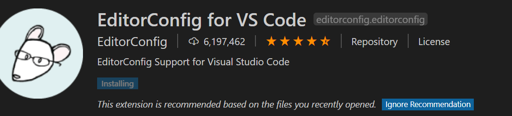
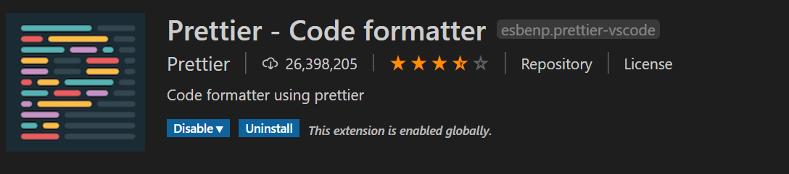
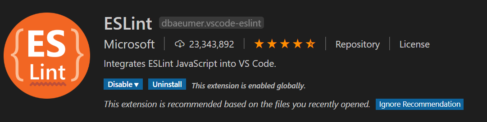
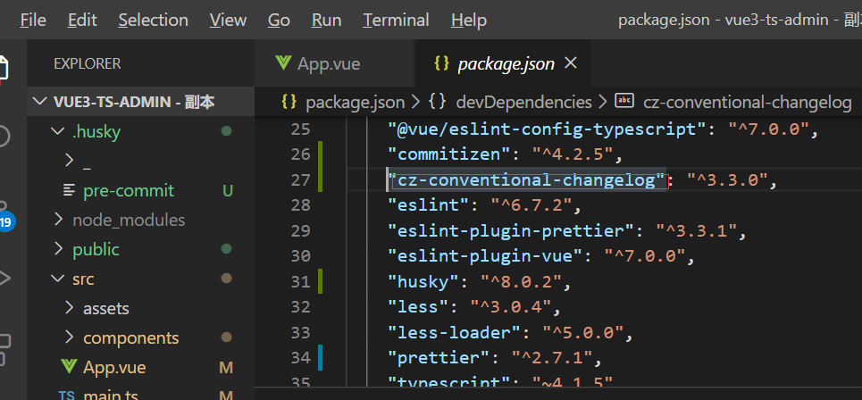
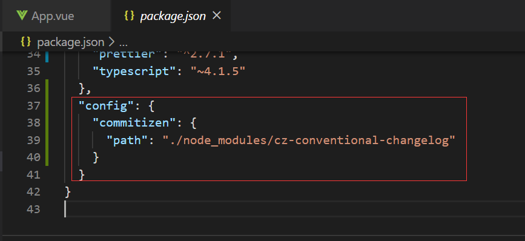
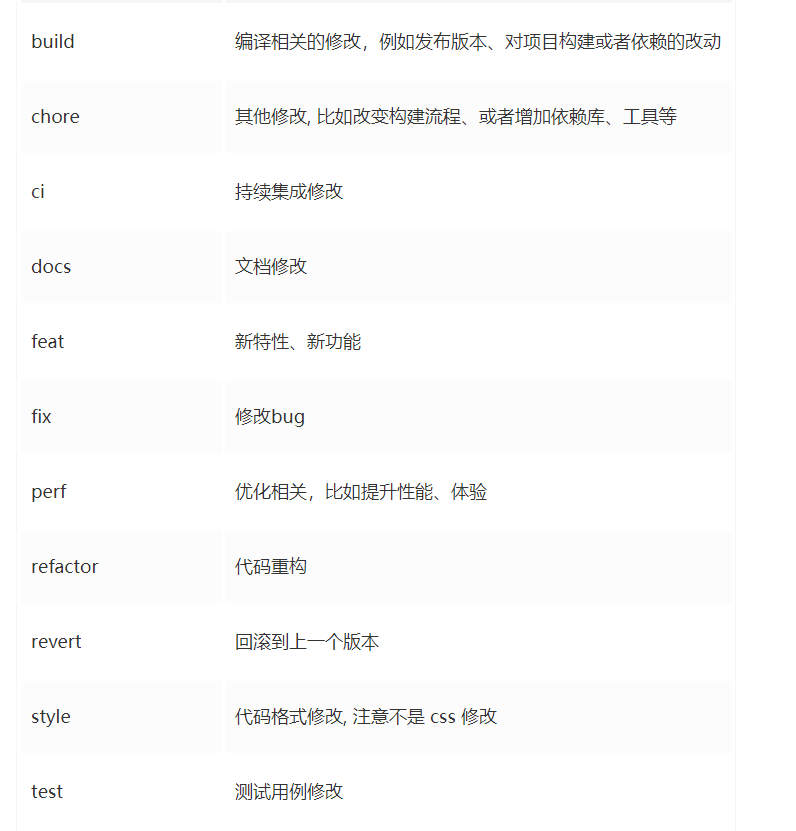
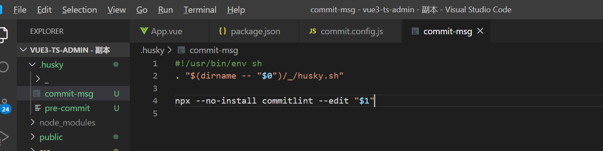

# vue3-ts-admin

## Project setup
```
npm install
```

### Compiles and hot-reloads for development
```
npm run serve
```

### Compiles and minifies for production
```
npm run build
```

### Lints and fixes files
```
npm run lint
```

### Customize configuration
See [Configuration Reference](https://cli.vuejs.org/config/).

##  项目搭建

### 使用脚手架初始化项目

```js
vue createe vue3-ts-admin
```



之后手动配置router、vuex



初始化目录结构



### 项目规范

#### 1、集成editorcinfig配置

editorConfig有助于为不同的IDE编辑器（vscode、webstorm等）上处理同一个项目的多个开发人员维护一致的编码风格。在 根目录下创建.editorconfig

```json
# http://editorconfig.org

root = true

[*] # 表示所有文件适用
charset = utf-8 # 设置文件字符集为utf-8
indext_style = space #缩进风格（他把| space）
index_size = 2 # 缩进大小
end_of_line = lf # 控制换行类型（lf | cr | trlf）
trim_trailing_whitespace = true # 去除行首的任意空白字符
insert_final_newline = true # 始终在文件末尾 添加新行

[*.md] # 表示仅 md 文件适用一下规则
max_line_length = off
trim_trailing_whitespace = false

```

#### 2、在vscode中安装插件 EditorConfig for VS Code



#### 3、使用prettier工具

prettirer 是一款强大的代码格式化工具，支持js、ts、css、scss、lesss、jsx、angular、vue等语言，基本上前端能用到的文件格式它都可以搞定，是当下最流行的代码格式化工具。

1. 安装prettier

​	```npm install prettier -D```

2. 配置.prettierrc文件

   - useTabs: 使用tab缩进还是空格缩进，选择false;
   - tabWidthL: tab是空格的情况下，是几个空格，选择2个；
   - printWidth: 当行字符的长度，推荐80，也有人喜欢100或者120；
   - singleQuote: 使用单引号还是双引号，选择true，使用单引号；
   - trailingComma: 在多行输入的尾逗号是否 添加，设置为none;
   - semi: 语句未尾是否要加分号，默认值是true,选择false表示不添加；

   ```js
   {
     "useTabs": false,
     "tabWidth": 2,
     "printWidth": 80,
     "singleQuote": true,
     "trailingComma": "none",
     "semi": false
   }
   ```

3. 配置.prettierignore，某些文件不需要prettier代码格式文件，则可以配置到这个文件中

   ```js
   /dist/*
   .local
   .output.js
   /node_modules/**
   
   **/*.svg
   **/*.sh
   
   /public/*
   
   ```

4. vscode 需要安装prettier的插件

5. 测试prettier是否生效

   - 测试一：在代码中保存代码

   - 测试二：配置一次性修改的命令 package.json,配置有个scripts,一次性格式化代码

     ```js
     "prettier": "prettier --write ."
     ```

#### 4、使用eslint检查

1. vscode安装eslint

2. 解决eslint和prettier冲突的问题：

   安装插件：（在vue创建项目时候，如果选择prettier,那么这两个插件会自动安装）

   ```js
   npm i eslint-plugin-prettier eslint-config-prettier -D
   ```

   添加prettier插件：在.eslintrc.js中添加

   ```js
   extends: [
       'plugin:vue/vue3-essential',
       'eslint:recommended',
       '@vue/typescript/recommended',
       '@vue/prettier',
       '@vue/prettier/@typescript-eslint',
       'plugin:prettier/recommended'
     ],
       
   module.exports = {
     root: true,
     env: {
       node: true
     },
     extends: [
       'plugin:vue/vue3-essential',
       'eslint:recommended',
       '@vue/typescript/recommended',
       '@vue/prettier',
       '@vue/prettier/@typescript-eslint',
       'plugin:prettier/recommended'
     ],
     parserOptions: {
       ecmaVersion: 2020
     },
     rules: {
       'no-console': process.env.NODE_ENV === 'production' ? 'warn' : 'off',
       'no-debugger': process.env.NODE_ENV === 'production' ? 'warn' : 'off'
     }
   }
   ```


1. ####  5、git Husky 和eslint

   虽然 我们已经要求项目使用eslint了，但是不能保证组员 提交代码之前都将eslint中的问题解决掉了。

   - 也就是我们希望保证代码仓库中的代码也是要符合eslint规范的。
   - 那梦我们需要在组员执行git commit 命令的时候对其进行校验, 如果不符合eslint规范，那么自动通过规范进行修复。

   那么如何做到这一点呢？可以通过husky工具

   - husky是一个git hook工具，可以 帮助我们触发git提交的各个阶段：pre-commit,commit-msg,pre-push

   如何使用husky呢？

   这里我们可以使用自动配置命令：

   ```js
   npx husky-init
   npm install husky -D
   ```

   这里会做三件事：

   1.安装husky相关的依赖：

   

   2.项目目录下创建.husky 文件夹：

   

   3.在package.json中添加一个脚本


​		接下来，我们需要去完成一个操作，在运行commit时候，执行lint脚本。


#### 6、git commit规范

​	通常我们的git commit 会按照统一的风格来提交，这样可以快速定位提交的内容，方便之后对版本进行控制。但是如果每次手动来编写这些是比较麻烦的事情，我们可以使用一个 工具：commitizen

- commitizen 是一个帮助我们去规范commit message的工具：

  1. 安装commitizen

     ```js
     npm install commitizen -D
     ```

  2. 安装cz-conventional-changelog，并且初始化cz-conventional-changelog

     ```js
     npx commitizen init cz-conventional-changelog --save-dev --save-exact
     ```

  3. 这个命令会帮助我们安装cz-conventional-changelog

     

  4. 并且在package.json中进行配置：

     

  5. 在package.json中配置commit命令，执行git  cz

     

     - 第一步是选择type,本次更新的类型

       

  - 第二部是选择本次修改的范围（作用域）

  - 第三步选择提交的信息

  - 第四步输入更详细的信息，可以 跳过

  - 第五步是否是一次大更新？

  - 第六步这次改变是否影响到某个open issue

  - 

    

- 如果我们按照cz来规范了提交风格，但是依然有同事通过git commit 按照不规范的格式提交后怎么办？

  - 我们可以通过commitlint来限制提交：

  - 安装 @commitlint/cli @commitlint/config-conventional

    ```js
    npm i @commitlint/cli @commitlint/config-conventional -D
    ```

  - 在根目录创建commitlint.config.js文件，配置commitlint

    ```js
    module.exports = {
      extends: ['@commitlint/config-conventional']
    }
    ```

  - 使用huskys生成commit-msg文件，验证提交信息：

    ```js
    npx husky add .husky/commit-msg 'npx --no-install commitlint --edit "$1"' 该命令 不行直接
    npx husky add .husky/commit-msg 然后在文件里面添加npx --no-install commitlint --edit "$1"
    ```

    

  - 这个时候提交的话就会报错了

    

#### 7、配置vscode的eslint和prettier

setting.json中添加如下规则，那么eslint和prettier就会生效

```jso
{ 
	"editor.formatOnSave": true, // 开启保存文件自动格式化代码
    "editor.defaultFormatter": "esbenp.prettier-vscode", // 默认的代码格式化工具
    "prettier.requireConfig": true, // 需要prettier的配置文件
    "eslint.enable": true, // eslint开启
    "editor.codeActionsOnSave": {
       "source.fixAll.eslint": true // 代码保存使用eslint格式化
     }
}     
```


```json
{
    "less.compile": {
        "outExt": ".wxss"
    },
    "files.autoSave": "off",
    "files.associations": {
        "*.wpy": "vue",
        "*.vue": "html"
    },
    "explorer.confirmDelete": false,
    "open-in-browser.default": "Chrome",
    "window.zoomLevel": 0,
    "markdown-preview-enhanced.previewTheme": "atom-light.css",
    "[plaintext]": {
        
    },
    "git.path": "D:/git/Git/cmd/git.exe",
    "[html]": {},
    "editor.formatOnSave": true, // 开启保存文件自动格式化代码
    "editor.defaultFormatter": "esbenp.prettier-vscode", // 默认的代码格式化工具
    "prettier.requireConfig": true, // 需要prettier的配置文件
    "eslint.enable": true, // eslint开启
    "editor.codeActionsOnSave": {
       "source.fixAll.eslint": true // 代码保存使用eslint格式化
     }
}
```

